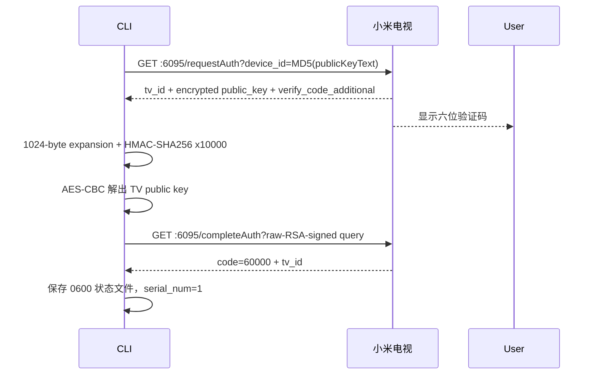

# Mi TV Assistant Airkan 协议速查

## 服务分工

- `6095`：发现、`requestAuth`、`completeAuth`、系统信息、应用列表、`startapp`。
- `9095`：较新电视上的 `phoneAppInstallV2` APK 安装服务。
- 旧实现可能把安装放在 `6095`，但 MUST 先探测；不要因控制接口在线就假设安装端点也在同一端口。

## 配对状态机



## 字节级约束

### 自定义 Base64

Airkan 使用标准 Base64 字符表，但把尾部 `=` 替换成 `$`。解码前把 `$` 还原为 `=`。

### 验证码派生

输入是 `six_character_code + verify_code_additional`。转为字节后创建 1024 字节零数组，仅填充索引 `0..999`，按输入循环；末尾 24 字节保持零。随后以固定 HMAC key `3e4f2550-0818-4665-9bfb-edbe9b15f586` 执行 10000 轮 HMAC-SHA256。

最终 32 字节摘要做自定义 Base64。编码文本对半切分：前半前 16 字符为 AES key，后半前 16 字符为 IV。用 `AES/CBC/PKCS5Padding` 解密 `requestAuth.resp_data.public_key`。

### 电视公钥提取

AES 明文以 `airkan` 开头。移除前缀后，再移除 16 字节随机头，余下文本是电视 X.509 DER 公钥的自定义 Base64。

### 裸 RSA

`completeAuth` 与后续签名请求使用 BouncyCastle 下 `Cipher.getInstance("RSA")` 的裸 RSA 行为，不是 PKCS#1 v1.5。计算方式是 `cipher = message^e mod n`，输出补齐到模数长度。

配对明文：

```text
airkandevicePublicKey=<client_public_key>&serial_num=1
```

后续无参数签名明文：

```text
airkanserial_num=<next_serial>
```

查询参数固定包含 `device_id`、`magic`、`tail=0`、`encrypt`。`encrypt` 必须 URL 编码。

## 流水号

客户端每构造一次已授权请求就递增本地 `serial_num`。状态落后时，安装服务返回：

```json
{"code": 60007, "msg": "Error: invalid serial num!"}
```

CLI 用带签名的空 `POST /phoneAppInstallV2` 从本地下一号开始探测。命中当前流水号时返回 `data_status=1010`（空 APK），该请求会消费流水号；随后真实上传使用下一号。

## APK 上传

使用固定 multipart boundary `--------httpPostFromPhone`，字段名 `Filedata`，并发送 `FileName`、`Accept: text/*` 和准确的 `Content-Length`。成功接收的判据是：

```json
{"data_status": 200}
```

## 应用验证

应用列表：

```text
GET :6095/controller?action=getinstalledapp&count=999&changeIcon=1
```

启动包名：

```text
GET :6095/controller?action=startapp&type=packagename&packagename=<PACKAGE>
```

控制接口返回 `status=0` 说明请求被接受，但 DRM 应用仍需单独验证登录、播放和清晰度。

## 常见错误

- `60010`：常见于错误 `device_id`、错误端口或失效配对上下文。
- `60007`：流水号不匹配；先同步，不要重做密码学流程。
- `408` + `session=null`：未签名安装会话等待屏幕授权。
- `1010`：签名通过但请求没有有效 APK 内容，适合作为流水号同步探针。
- `200` HTTP 但无 `data_status=200`：不能宣称安装完成。
